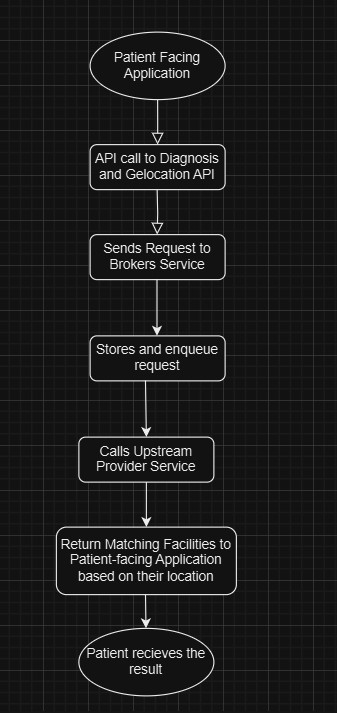
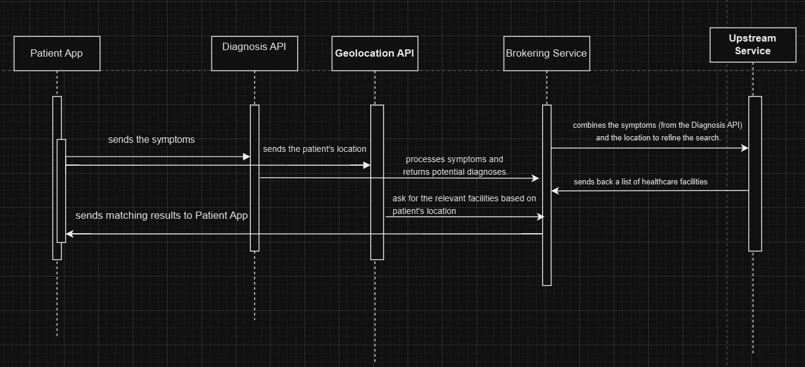

**Project Healthcare Documentation**

1. Detailed Product Documentation

Product Details: Project Healthcare, also known as the brokering service, is an open-source initiative aimed at integrating patient-facing applications with location-aware consultation and diagnostics services. It achieves this by providing:

**Diagnosis API** to capture patient symptoms.

**Geolocation API** to locate nearby healthcare facilities based on patient needs.

Built on the **BlackSheep** framework, it adheres to domain-driven design and uses a sandwich service model, facilitating seamless data flow between upstream providers and downstream consumer services. The platform focuses on personalized, cost-effective healthcare integration, especially for underserved and rural communities.

Hardware Requirements:

- Processor: Dual-core CPU (e.g., Intel Core i3 or equivalent)
- RAM: 4 GB
- Storage: 10 GB free space
- OS: Windows 10, macOS 10.15, or Linux.

Software Requirements:

- Python 3.8+
- BlackSheep Web Framework
- SQLAlchemy
- Docker
- Poetry

Libraries:

- python = "^3.12"
- pydantic = "^2.9.1"
- blacksheep = "^2.0.7"
- Hypercorn = "^0.17.3"
- MarkupSafe = "^2.1.3"
- uvloop = {version = "^0.20.0", markers = "sys_platform != 'win32'"}
- pydantic-settings = {version = "^2.3.4", markers = "sys_platform != 'win32'"}
- cython = "^3.0.11"
- sqlalchemy = {version="^2.0.34", markers = "sys_platform != 'win32'", extras = \["asyncio"\]}
- alembic = "^1.13.2"
- aiosqlite = "^0.20.0"
- sqlmodel = {version="^0.0.22"}
- rich = {version = "^13.8.0"}
- spatialite = "^0.0.3"

Tools:

- Postman for endpoints testing
- Deploy to Render and test the instance on render

APIs:

Core APIs:

1) Diagnosis API : Captures patient symptoms and fetches relevant healthcare facility data.

2) Geolocation API : Captures the patient's location and suggests nearby facilities.

Documentation Standards:

- Explore [OpenAPI Specification (OAS)](https://www.neoteroi.dev/blacksheep/openapi/)

Required Tech Skills

- - Docker and container orchestration
    - Python
    - Blacksheep
    - Flask

Detailed Code Documentation

1. Tutorials:
    1. [Docker tutorial for beginner](https://docker-curriculum.com/)
    2. [Flask Tutorial: Building APIs with Flask from scratch](https://nordicapis.com/how-to-create-an-api-from-scratch-using-python-and-flask/)
    3. [Getting started with Blacksheep](https://github.com/Neoteroi/BlackSheep)
    4. [Learn what is API?](https://www.datacamp.com/tutorial/python-api)
    5. [SQL Alchemy for beginners](https://www.datacamp.com/tutorial/sqlalchemy-tutorial-examples)
    6. [Explore SQLAlchemy Documentation](https://docs.sqlalchemy.org/en/14/orm/tutorial.html)
    7. [Blacksheep OpenAPI documentation](https://www.neoteroi.dev/blacksheep/openapi/)
    8. [Render Deployment Guide](https://coding-boot-camp.github.io/full-stack/render/render-deployment-guide)
2. Blogs:
    1. [Presenting BlackSheep, one of today's fastest web frameworks for Python](https://robertoprevato.github.io/Presenting-BlackSheep/)
    2. [Building Flask](https://medium.com/@noransaber685/building-a-flask-blog-a-step-by-step-guide-for-beginners-8bffe925cd0e)
    3. [SQLAlchemy: ORM tutorial](https://auth0.com/blog/sqlalchemy-orm-tutorial-for-python-developers/)
    4. [OpenAPI Specification](https://swagger.io/specification/)
    5. [Docker](https://waltercode.medium.com/in-depth-docker-faa0c4dd9a63)
3. Videos:
    1. [Blacksheep](https://www.youtube.com/watch?v=DgRVCXfv0aM)
    2. [OpenApi Integration](https://www.youtube.com/watch?v=wpgST6DCKSw)
    3. [Understanding OpenAPI](https://www.youtube.com/watch?v=6kwmW_p_Tig)
4. Installation Steps:
    1. Clone the repository
    2. Installing dependencies
    3. Run the App

Link to [README.md](https://github.com/Khan-Ramsha/project-healthcare/blob/main/README.md)

1. Functional Sandbox Environment:

A public sandbox environment is available for testing the application.

Visit- [Sandbox URL](https://project-healthcare.onrender.com/docs)

There are 2 endpoints related to diagnosis and geolocation-

DiagnosisController (/diagnose)

**POST /diagnose**

- **Parameters:**
  - - - - X-Origin-Match-Header (header, string)
- **Request Body (JSON format):**

{

"query": "string",

"query_id": {

"query_id": "string"

}

}

- **Response:**

If entered **secret** in X-Origin-Match-Header it returns ok with 200 success code.

If not secret it generates error status 400 with response: Invalid origin match header value provided.

**POST /geo**

- **Parameters:**
  - - - - X-Origin-Match-Header (header, string)
- **Request Body (JSON format):**

{

"location": {

"lat": ,

"lng":

},

"cust_id": {

"cust_id": "string"

},

"query_id": {

"query_id": "string"

}

}

- **Response:**

If entered **secret** in X-Origin-Match-Header it returns ok with 200 success code.

If not secret it generates error status 400 with response: Invalid origin match header value provided.

If latitude (lat) and longitude (lng) not provided with cust and query id input, It gives 400 status code, If with correct lat and lng provided in request body, response generated is 200 status code.

1. Technical Architecture
    a). Flowchart
        
    b) Sequence Diagram
        