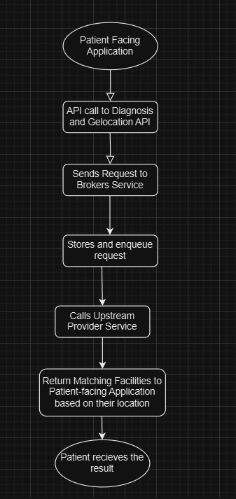
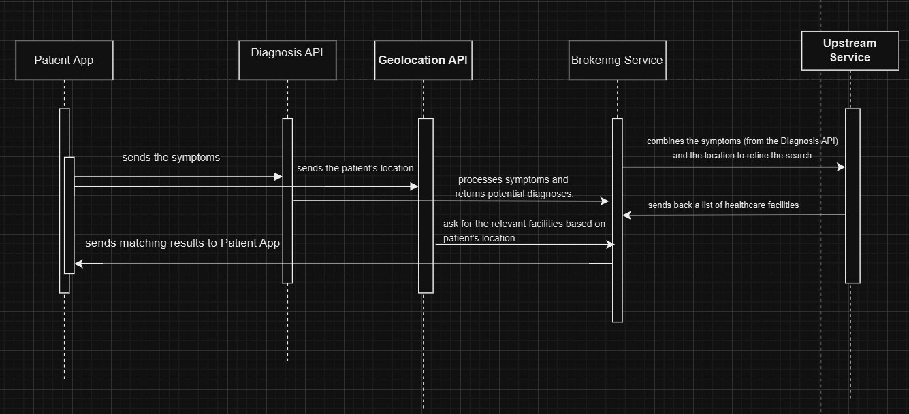

# Project Healthcare Documentation

## 1. Detailed Product Documentation

### Product Details
Project Healthcare, also known as the **brokering service**, is an open-source initiative aimed at integrating patient-facing applications with location-aware consultation and diagnostics services. It achieves this by providing:

- **Diagnosis API** to capture patient symptoms.
- **Geolocation API** to locate nearby healthcare facilities based on patient needs.

The service exposes a **GraphQL** API and adheres to domain-driven design while using a sandwich service model. It facilitates seamless data flow between upstream providers and downstream consumer services with a focus on personalized, cost-effective healthcare integration for underserved and rural communities.

### Hardware Requirements

- **Processor**: Dual-core CPU (e.g., Intel Core i3 or equivalent)
- **RAM**: 4 GB
- **Storage**: 10 GB free space
- **OS**: Windows 10, macOS 10.15, or Linux.

### Software Requirements

- **Python**: 3.8+
- **SQLAlchemy**
- **Docker**
- **Poetry**

### Libraries

- `python = "^3.12"`
- `pydantic = "^2.9.1"`
- `strawberry-graphql = "^0.258.0"`
- `Hypercorn = "^0.17.3"`
- `MarkupSafe = "^2.1.3"`
- `uvloop = {version = "^0.20.0", markers = "sys_platform != 'win32'"} `
- `pydantic-settings = {version = "^2.3.4", markers = "sys_platform != 'win32'"} `
- `cython = "^3.0.11"`
- `sqlalchemy = {version="^2.0.34", markers = "sys_platform != 'win32'", extras = ["asyncio"]}`
- `alembic = "^1.13.2"`
- `aiosqlite = "^0.20.0"`
- `sqlmodel = {version="^0.0.22"}`
- `rich = {version = "^13.8.0"}`
- `spatialite = "^0.0.3"`

### Tools

- **Postman** for endpoint testing
- **Render** for deployment and instance testing

### Core APIs

1. **Diagnosis API**: Captures patient symptoms and fetches relevant healthcare facility data.
2. **Geolocation API**: Captures the patient's location and suggests nearby facilities.

### Documentation Standards

- Explore [OpenAPI Specification (OAS)](https://swagger.io/specification/)

---

## 2. Required Tech Skills

- Docker and container orchestration
- Python
- Flask

---

## 3. Detailed Code Documentation

### Tutorials:
1. [Docker Tutorial for Beginners](https://docker-curriculum.com/)
2. [Flask Tutorial: Building APIs with Flask](https://nordicapis.com/how-to-create-an-api-from-scratch-using-python-and-flask/)
3. [What is an API?](https://www.datacamp.com/tutorial/python-api)
4. [SQLAlchemy for Beginners](https://www.datacamp.com/tutorial/sqlalchemy-tutorial-examples)
5. [Explore SQLAlchemy Documentation](https://docs.sqlalchemy.org/en/14/orm/tutorial.html)
6. [GraphQL Basics](https://graphql.org/learn/)
7. [Render Deployment Guide](https://coding-boot-camp.github.io/full-stack/render/render-deployment-guide)

### Blogs:
1. [Building Flask: A Step-by-Step Guide for Beginners](https://medium.com/@noransaber685/building-a-flask-blog-a-step-by-step-guide-for-beginners-8bffe925cd0e)
2. [SQLAlchemy ORM Tutorial](https://auth0.com/blog/sqlalchemy-orm-tutorial-for-python-developers/)
3. [OpenAPI Specification](https://swagger.io/specification/)
4. [Docker In-Depth](https://waltercode.medium.com/in-depth-docker-faa0c4dd9a63)

### Videos:
1. [OpenAPI Integration](https://www.youtube.com/watch?v=wpgST6DCKSw)
2. [Understanding OpenAPI](https://www.youtube.com/watch?v=6kwmW_p_Tig)
3. [GraphQL Introduction](https://www.youtube.com/watch?v=Y0lDGjwRYKw)

### Installation Steps:
1. Clone the repository
2. Install dependencies
3. Run the app

Link to the [README.md](project-healthcare/blob/main/README.md)

---

## 4. Functional Sandbox Environment

A public sandbox environment is available for testing the application.

Visit: [Sandbox URL](https://project-healthcare.onrender.com/docs)

There are 2 endpoints related to diagnosis and geolocation:

### DiagnosisController (/diagnose)

#### **POST /diagnose**

- **Parameters**:
  - `X-Origin-Match-Header` (header, string)

- **Request Body (JSON format)**:
  ```json
  {
    "query": "string",
    "query_id": {
      "query_id": "string"
    }
  }
  ```

- **Response**:
  - If the `X-Origin-Match-Header` is `secret`, it returns an OK response with a 200 success code.
  - If the `X-Origin-Match-Header` is not `secret`, it generates an error with a 400 status code: "Invalid origin match header value provided."

#### **POST /geo**

- **Parameters**:
  - `X-Origin-Match-Header` (header, string)

- **Request Body (JSON format)**:
  ```json
  {
    "location": {
      "lat": <latitude>,
      "lng": <longitude>
    },
    "cust_id": {
      "cust_id": "string"
    },
    "query_id": {
      "query_id": "string"
    }
  }
  ```

- **Response**:
  - If the `X-Origin-Match-Header` is `secret`, it returns an OK response with a 200 success code.
  - If the `X-Origin-Match-Header` is not `secret`, it generates an error with a 400 status code: "Invalid origin match header value provided."
  - If latitude (`lat`) and longitude (`lng`) are not provided with the `cust_id` and `query_id`, it returns a 400 status code.
  - If correct `lat` and `lng` are provided, it generates a 200 status code response.

### GraphQL API Quickstart

Run the GraphQL server locally:

```bash
hypercorn -b 127.0.0.1:5000 --reload xcov19.app.graphql.main:app
```

Open [http://localhost:5000/graphql](http://localhost:5000/graphql) to access the GraphiQL interface.

Example queries:

```graphql
mutation {
  enqueueDiagnosisQuery(query: "fever and cough")
}
```

```graphql
mutation {
  storeQueryGeolocation(
    queryId: "<QUERY_ID>"
    geolocation: { lat: 12.97, lng: 77.59 }
  )
}
```

```graphql
{
  facilities {
    name
    address { city state }
    facilityType
    specialties
  }
}
```

---

## 5. Technical Architecture

### a) Flowchart



### b) Sequence Diagram


